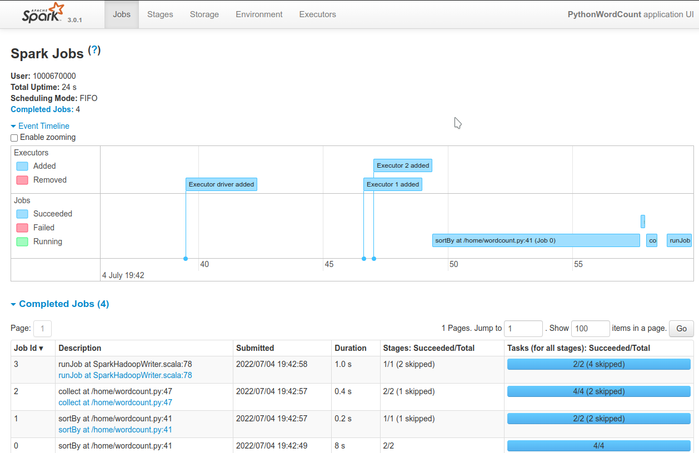

= Spark on OpenShift
:toc:

== What will you find here?

*Repository Description*

This repository presents different ways of working with Spark on OpenShift, either standalone or alongside Open Data Hub or OpenShift Data Science:

- Using the https://github.com/GoogleCloudPlatform/spark-on-k8s-operator[*Spark on Kubernetes Operator*].
- With or without the operator, from a Workbench in a Notebook or a Terminal view.
- Without the operator, directly with a spark-submit command.

There is no "best solution", you can freely choose the one most adapted to your needs.

*Compatibility*:

- Tested with OpenShift 4.7-4.13
- The provided custom *Spark* images include S3 connectors and committers, as well as JMX exporter for monitoring.
- There is no dependance with Open Data Hub or OpenShift Data Science, so this will work with any version.

== Custom Spark Images

This project includes custom Spark images recipes featuring the Hadoop S3a connector to connect to S3-based object storage. Those images are based on https://catalog.redhat.com/software/containers/ubi8/openjdk-8/5dd6a48dbed8bd164a09589a[ubi8/openjdk-8], and are updated accordingly.

Pre-built images are also provided in the following repositories. You can of course also choose to build your own, especially if you need or want to include your own libraries or applications.

Available images:

* Spark images, available at https://quay.io/repository/opendatahub-contrib/spark:
    ** Spark 2.4.4 + Hadoop 2.8.5
    ** Spark 2.4.6 + Hadoop 3.3.0
    ** Spark 3.0.1 + Hadoop 3.3.0
    ** Spark 3.3.0 + Hadoop 3.3.3
    ** Spark 3.3.1 + Hadoop 3.3.4
* PySpark images, available at https://quay.io/repository/opendatahub-contrib/pyspark:
    ** Spark 2.4.4 + Hadoop 2.8.5 + Python 3.6
    ** Spark 2.4.6 + Hadoop 3.3.0 + Python 3.6
    ** Spark 3.0.1 + Hadoop 3.3.0 + Python 3.8
    ** Spark 3.3.0 + Hadoop 3.3.3 + Python 3.9
    ** Spark 3.3.1 + Hadoop 3.3.4 + Python 3.9

=== Manually building custom Spark images

In the `spark-images` folder you will find the sources for the pre-built images. You can rebuild them again, or use them as templates for your own images, should you want to change libraries versions or add others. Pay attention to the slight differences in the Containerfiles depending on the version of Spark, Hadoop or Python you want to install.

Example, from the `spark-images` folder:

.Build the Spark 3.3.0 + Hadoop 3.3.3 image
[source,bash]
----
podman build --file spark-3.3.0_hadoop-3.3.3.Containerfile --tag spark-odh:s3.3.0-h3.3.3_v0.0.1 .
----

.(Optional) Tag and Push the image to your repo
[source,bash]
----
podman tag spark-odh:s3.3.0-h3.3.3_v0.0.1 your_repo/spark-odh:s3.3.0-h3.3.3_v0.0.1
podman push your_repo/spark-odh:s3.3.0-h3.3.3_v0.0.1
----

You can also extend a Spark image with Python to create a PySpark-compatible image:

.Build the PySpark image
[source,bash]
----
podman build --file pyspark.Containerfile --tag pyspark-odh:s3.3.0-h3.3.3_v0.0.1 --build-arg base_img=spark-odh:s3.3.0-h3.3.3_v0.0.1 .
----

.(Optional) Tag and Push the image to your repo
[source,bash]
----
podman tag pyspark-odh:s3.3.0-h3.3.3_v0.0.1 your_repo/pyspark-odh:s3.3.0-h3.3.3_v0.0.1
podman push your_repo/pyspark-odh:s3.3.0-h3.3.3_v0.0.1
----

== Spark History Server

All the methods presented here create ephemeral workloads (after all, that's the purpose of Kubernetes!). So unless you look at the logs in real time, you will loose all related information after a workload is finished.

To avoid losing this precious information, you can (and you should!) send all the logs to a specific location and set up the Spark History Server to be able to view and interpret them at any time. 

The logs location has to be a shared storage that all pods can access simultaneously, so Object Storage (S3), Hadoop (HDFS), NFS,...

In all our examples we will be using Object Storage.

NOTE: All the following commands are executed from the `spark-history-server` folder.

=== Object storage bucket

First, create a dedicated bucket to store the logs from the Spark jobs.

For example, you can create an Object Bucket Claim with OpenShift Data Foundation. The provided YAML file will create a bucket using the Multi-Cloud Gateway. Please adapt this depending on your chosen storage solution.

.Create the OBC
[source,bash]
----
oc apply -f spark-hs-obc.yaml
----

IMPORTANT: The Spark/Hadoop instances cannot log directly into an empty bucket. A non-empty "folder" must exist where the logs will be sent. We will help Spark/Hadoop by uploading an empty hidden file to the location where we want this folder.

Retrieve your Access and Secret Key, the name of the Bucket, and the Endpoint to the S3 storage (from the Secret and ConfigMap named `obc-spark-history-server` if you used the provided OBC, or from your other storage solution).

.Upload a small file to the bucket (here using the https://aws.amazon.com/cli/[AWS CLI])
[source,bash]
----
export AWS_ACCESS_KEY_ID=YOUR_ACCESS_KEY
export AWS_SECRET_ACCESS_KEY=YOUR_SECRET_ACCESS_KEY
export S3_ROUTE=YOUR_ROUTE_TO_S3
export BUCKET_NAME=YOUR_BUCKET_NAME
aws --endpoint-url $S3_ROUTE s3 cp .s3keep s3://$BUCKET_NAME/logs-dir/.s3keep
----

Alternatively, if you used the OBC, you can run the following command to extract the data directly from OpenShift.

.Upload a small file to the bucket (here using the https://aws.amazon.com/cli/[AWS CLI]) automatically
[source,bash]
----
export AWS_ACCESS_KEY_ID=$(oc get secret obc-spark-history-server -o go-template --template="{{.data.AWS_ACCESS_KEY_ID|base64decode}}")
export AWS_SECRET_ACCESS_KEY=$(oc get secret obc-spark-history-server -o go-template --template="{{.data.AWS_SECRET_ACCESS_KEY|base64decode}}")
export S3_ROUTE="https://$(oc get route s3 -o jsonpath='{.spec.host}' -n openshift-storage)"
export BUCKET_NAME=$(oc get cm obc-spark-history-server -o jsonpath='{.data.BUCKET_NAME}')
aws --endpoint-url $S3_ROUTE s3 cp .s3keep s3://$BUCKET_NAME/logs-dir/.s3keep
----

Naming this file `.s3keep` will mark it as hidden from from the History Server and Spark logging mechanism perspective, but the "folder" will appear as being present, making everyone happy!

You will find an empty `.s3keep` file that you can already use in the `spark-history-server` folder.


=== History Server deployment

We can now create the service account, Role, RoleBonding, Service, Route and Deployment for the History Server.

.Fully deploy the History Server
[source,bash]
----
oc apply -f spark-hs-deployment.yaml
----

The UI of the Spark History Server is now accessible through the Route that was created, named `spark-history-server`. Note that there is not authentication set to access the History Server. Should you want to restrict access to it, you have to setup some access control mechanism, like an OAuth-proxy container inside the History Server Pod.

== Working with the Spark Operator

The Spark Operator is a simple Kubernetes-native way of launching Spark jobs. It provides a CustomResourceDefinition (SparkApplication) that allows you to simply create a YAML file with your Job configuration. You can then simply apply this file to your OpenShift environment and let the operator handle the Spark job creation, execution, monitoring, and cleanup.

=== Installation

==== Namespace

The operator will be installed in its own namespace but will be able to monitor all namespaces for jobs to be launched.

.Create the namespace
[source,bash]
----
oc new-project spark-operator
----

NOTE: From now on all the `oc` commands are supposed to be run in the context of this project.

==== Operator

We can use the standard version of the Spark on Kubernetes Operator at its latest version.

.Add the helm repo
[source,bash]
----
helm repo add spark-operator https://kubeflow.github.io/spark-operator
helm repo update
----

.Deploy the helm chart
[source,bash]
----
helm install spark-operator spark-operator/spark-operator --namespace spark-operator  --create-namespace  --set image.tag=v1beta2-1.3.3-3.1.1 --set webhook.enable=true --set resourceQuotaEnforcement.enable=true 
----

==== Spark Monitoring (Optional)

NOTE: this section needs revision to adapt to latest versions of Grafana/Prometheus.

We can monitor the Spark operator itself, as well as the applications it creates with Prometheus and Grafana. Note that this is only monitoring and reporting on the workload metrics. To get information about the Spark Jobs themselves you need to deploy the Spark History Server (see above).

NOTE: *Prerequisites*: Prometheus and Grafana must be installed in your environment. The easiest way is to use their respective operators. Deploy the operators in the `spark-operator` namespace, and create simple instance of Prometheus and Grafana.

From the `spark-operator` folder:

.Create the two Services that will expose the metrics
[source,bash]
----
oc apply -f spark-application-metrics_svc.yaml
oc apply -f spark-operator-metrics_svc.yaml
----

.For Prometheus configuration, create the Spark Service Monitor
[source,bash]
----
oc apply -f spark-service-monitor.yaml
----

.For Grafana configuration, create the Prometheus Datasource
[source,bash]
----
oc apply -f prometheus-datasource.yaml
----

NOTE: We also need another datasource to retrieve base CPU and RAM metrics from Prometheus. To do that we will connect to the "main" OpenShift Prometheus with the following procedure.

.Grant the Grafana Service Account the cluster-monitoring-view cluster role:
[source,bash]
----
oc adm policy add-cluster-role-to-user cluster-monitoring-view -z grafana-serviceaccount
----

.Retrieve the bearer token used to authenticate to Prometheus:
[source,bash]
----
export BEARER_TOKEN=$(oc serviceaccounts get-token grafana-serviceaccount)
----

Deploy `main-prometheus-datasource.yaml` file with the `BEARER_TOKEN` value.

.Create the "main" Prometheus Datasource
[source,bash]
----
cat main-prometheus-datasource.yaml | sed -e "s/BEARER_TOKEN/$BEARER_TOKEN/g" | oc apply -f -
----

.Create the Grafana dashboards
[source,bash]
----
oc apply -f spark-operator-dashboard.yaml
oc apply -f spark-application-dashboard.yaml
----

==== Use Spark operator from other namespaces (Optional)

The operator creates a special ServiceAccount and a Role to create pods and services in the namespace where it is deployed.

If you want to create SparkApplication or ScheduledSparkApplication objects in other namespaces, you have to create an account, a role and a rolebinding into each of them.

The *ServiceAccount* you created in a namespace is the one you need to use in the SparkApplications you create in this specific namespace. Of course you can have several different ServiceAccounts in the same namespace, provided they have the right RoleBindings.

From the `spark-operator` folder, while in the target namespace (`oc project YOUR_NAMESPACE`):

.Create ServiceAccount with Role and RoleBinding
[source,bash]
----
oc apply -f spark-rbac.yaml
----

=== Spark Operator Usage

A quick test/demo can be done with the standard word count example from Shakespeare's sonnets. All the files are under the `examples/operator` folder.

==== Input data

Create a bucket and populate it with the data.

NOTE: The following ObjectBucketClaim creates a bucket with the MCG from an OpenShift Data Foundation deployment. Adapt the instructions depending on your S3 provider.

.Create the OBC
[source,bash]
----
oc apply -f obc.yaml
----

Retrieve the Access and Secret Key from the Secret named `spark-demo`, the name of the bucket from the ConfigMap named `spark-demo` as well as the Route to the S3 storage.

.Upload the data (the file `shakespeare.txt`), to the bucket
[source,bash]
----
export AWS_ACCESS_KEY_ID=YOUR_ACCESS_KEY
export AWS_SECRET_ACCESS_KEY=YOUR_SECRET_ACCESS_KEY
export S3_ROUTE=YOUR_ROUTE_TO_S3
export BUCKET_NAME=YOUR_BUCKET_NAME
aws --endpoint-url $S3_ROUTE s3 cp shakespeare.txt s3://$BUCKET_NAME/shakespeare.txt
----

Alternative, you can run the following command to extract the data directly from OpenShift.

.Upload the data (the file `shakespeare.txt`), to the bucket automatically
[source,bash]
----
export AWS_ACCESS_KEY_ID=$(oc get secret spark-demo -o go-template --template="{{.data.AWS_ACCESS_KEY_ID|base64decode}}")
export AWS_SECRET_ACCESS_KEY=$(oc get secret spark-demo -o go-template --template="{{.data.AWS_SECRET_ACCESS_KEY|base64decode}}")
export S3_ROUTE="https://$(oc get route s3 -o jsonpath='{.spec.host}' -n openshift-storage)"
export BUCKET_NAME=$(oc get cm spark-demo -o jsonpath='{.data.BUCKET_NAME}')
aws --endpoint-url $S3_ROUTE s3 cp shakespeare.txt s3://$BUCKET_NAME/shakespeare.txt
----

TIP: If your endpoint is using a self-signed certificate, you can add `--no-verify-ssl` to the command.

Our application file is `wordcount.py` that you can find in the folder. To make it accessible to the Spark Application, we will package it as data inside a Config Map. This CM will be mounted as a Volume inside our Spark Application YAML definition.

.Create the application Config Map
[source,bash]
----
oc apply -f wordcount_configmap.yaml
----

==== Basic Tests

We are now ready to launch our Spark Job using the SparkApplication CRD from the operator. Our YAML definition will:

* Use the application file (wordcount.py) from the ConfigMap mounted as a volume in the Spark Operator, the driver and the executors.
* Inject the Endpoint, Bucket, Access and Secret Keys inside the containers definition so that the driver and the workers can retrieve the data to process it.

.Launch the Spark Job (replace the version for corresponding yaml file)
[source,bash]
----
oc apply -f spark_app_shakespeare_version-to-test.yaml
----

If you look at the OpenShift UI you will see the driver, then the workers spawning. They will execute the program, then terminate.

image::doc/img/app_deployment.png[App deployment]

You can now retrieve the results:

.List folder content
[source,bash]
----
aws --endpoint-url $S3_ROUTE s3 ls s3://$BUCKET_NAME/
----

You will see that the results have been saved in a location called `sorted_count_timestamp`.

.Retrieve the results (replace `timestamp` with the right value)
[source,bash]
----
aws --endpoint-url $S3_ROUTE s3 cp s3://$BUCKET_NAME/sorted_counts_timestamp ./ --recursive
----

There should be different files:

* `_SUCCESS`: just an indicator
* `part-00000` and `part-00001`: the results themselves that will look like:

[source,text]
----
('', 2832)
('and', 490)
('the', 431)
('to', 414)
('my', 390)
('of', 369)
('i', 339)
('in', 323)
('that', 322)
('thy', 287)
('thou', 234)
('with', 181)
('for', 171)
('is', 167)
('not', 166)
('a', 163)
('but', 163)
('love', 162)
('me', 160)
('thee', 157)
....
----

So the sorted list of all the words with their occurrences in the full text.

While a job is running you can also have a look at the Grafana dashboards we created for monitoring. It will look like this:

image::doc/img/spark_operator_dashboard.png[Dashboard]

==== History Server Test

We will now run the same job, but log the output using our history server. Have a look at the YAML file to see how this is configured.

To send the logs to the history server bucket, you have to modify the `sparkconf`section starting at line 9. Replace the values for YOUR_BUCKET, AWS_ACCESS_KEY_ID and AWS_SECRET_ACCESS_KEY with the corresponding value for the history server bucket.

.Launch the Spark Job (replace the version for corresponding yaml file)
[source,bash]
----
oc apply -f spark_app_shakespeare_version-to-test_history_server.yaml
----

If you go to the history server URL, you now have access to all the logs and nice dashboards like this one for the different workloads you have run.



== Working directly with Spark/PySpark (without the operator)

=== Prerequisite

Spark supports Kubernetes natively since version 2.3. It means that Spark is able to talk directly to Kubernetes and use it as a scheduler to launch workloads (drivers and executors).

As Spark communicates with the Kubernetes API, it will use the account you are currently logged in with (either a User or ServiceAccount) unless you provide it with specific account information (authentication token). Therefore, this accounts needs to be able to perform certain tasks, like creating Pods (driver, executors), Services (for inter-pod communications), ConfigMaps (to store the ephemeral configuration).

The easiest way to make things work properly is to:

- Create a Role with the right permissions.
- Create a RoleBinding associating the account you will use (more on that later) to this Role.

In the `spark-operator` folder, you will find the file `spark-rbac.yaml`. You can copy the Role you need directly from it, and create this Role in the namespace you will be working in. The RoleBinding depends on the situations described below.

==== Workbench specifics

**ServiceAccount and RoleBinding**

When you are inside a Spark/PySpark enabled Workbench in ODH/RHODS, either from a Notebook using PySpark or from a Terminal view using the `spark-submit` command, you are not really logged inside the Pod with your own user account, but with a specific ServiceAccount.

- If your workbench is in the "common" namespace, meaning you launched it through the Enabled->Jupyter menu, this ServiceAccount will be named `jupyter-nb-your_username`.
- If your workbench is inside a Data Science Project, the ServiceAccount will be named the same as your Workbench (in the following example `pyspark`).

What you have to do to allow Spark to submit commands, is to apply the Role created previously to the the ServiceAccount used by the workbench.

For example, this RoleBinging will give the ServiceAccount `pyspark` the `spark-role` Role:

```yaml
kind: RoleBinding
apiVersion: rbac.authorization.k8s.io/v1
metadata:
  name: spark-role-binding
  namespace: my-data-science-project
subjects:
  - kind: ServiceAccount
    name: pyspark
    namespace: my-data-science-project
roleRef:
  apiGroup: rbac.authorization.k8s.io
  kind: Role
  name: spark-role
```

**Network Policy**

As ODH and RHODS are secured environment, there are Network Policies in place to make sure a "rogue" Pod  does not connect directly to your workbench environment (on port 8888). However, if the workbench you are working in acts as the driver for a Spark workload, the executors have to be able to communicate back to it. So we need to do two things:

- In our workload, fix the ports that the driver and the block manager will listen to. In the following example, they will respectively be 2222 and 7777.
- Create a NetworkPolicy that will allow ingress on those ports for our Workbench Pod.

Here is an example of such policy:

```yaml
kind: NetworkPolicy
apiVersion: networking.k8s.io/v1
metadata:
  name: spark-client-mode
  namespace: my-data-science-project
spec:
  podSelector:
    matchLabels:
      notebook-name: pyspark
  ingress:
    - ports:
        - protocol: TCP
          port: 2222
        - protocol: TCP
          port: 7777
      from:
        - podSelector: {}
  policyTypes:
    - Ingress
```

Of course, this is only an example. You could create more targeted or restricted policies by setting explicit properties for the executors and matching "from" PodSelector.

=== Working from inside a Workbench


==== Launching a job from a Notebook (PySpark)

NOTE: for this example, you will need a PySpark enabled Workbench image such as `quay.io/opendatahub-contrib/workbench-images:jupyter-spark-ubi9-py39_2023b_latest`. It must be imported in your ODH/RHODS installation beforehand.

In the `examples/standalone` folder, you will find a demo Notebook, `notebook-pyspark.ipynb` that will walk you through the use of PySpark for using the Notebook's pod environment as the Spark driver.

With the builtin support of Jupyter-server-proxy, you will have directly access to the Spark UI to monitor your Job.

==== Launching a job from a Terminal

Still inside your Workbench, from a Terminal view, you can also directly launch a spark-submit command. This would also work if you remotely connect to your Pod using `oc rsh`.

**Client Mode**

In the `examples/standalone` folder, the file `spark-submit-from-pod-client.sh` will show you how to launch a spark job in client mode, meaning the driver is spawned directly within your Pod environment.

This is a simple Pi calculation, but it gives you a good overview of how to pass the different configuration parameters, including the `--jars` one to transfer local jars from the driver to the executors.

NOTE: This can also be done from a Notebook cell with a leading **!** before the spark-submit command or other bash magics.

**Cluster Mode**

In cluster mode, the driver is spawned independently from where you launch the command. Then the driver will itself spawn the executors. That's why it's important to specify the right ServiceAccount that will be used by the driver Pod, and make sure the right RoleBindings are applied to allow it to launch other Pods.

Also, as everything will happen "outside" of the environment from where the `spark-submit` command will be launched, you will fly totally blind. So it's important to save the logs to a specific location, like the Spark History server storage. If you don't, you can still look at the logs from the driver Pod, which will stay in the Completed state, but this is less practical.

In the `examples/standalone` folder, the file `spark-submit-from-pod-cluster.sh` will show you how to launch a spark job in this cluster mode. This is a much more complex example for a TPC-DS benchmark workload generation (full benchmark code https://github.com/guimou/spark-tpcds[here]). To run this example you will need to setup S3 storage, and adapt the file to your own configuration. But again, it gives a good overview on how to submit a job, which parameters to pass and how.

=== Working from outside a Workbench

Launching your Spark job from outside of a Pod, or even from outside of your OpenShift cluster is really simple using the operator and simply applying YAML files.

However, especially when working with automation or orchestration, you may want to do it with plain spark-submit commands. This is totally feasible, and in fact almost identical to launching a job from a Terminal inside a Workbench, with some requirements/differences:

- You need Spark installed locally to use the spark-submit command.
- You also need the `oc` (or `kubectl`) CLI to log into the OpenShift cluster, or supply a login token with your `spark-submit` command.
- You (or your script) must be logged into OpenShift with an account that has permissions to create a Pod (the driver Pod) that will run under the ServiceAccount you created for Spark Jobs.
- It's easier to run your job in Cluster Mode. In Client Mode you have to make sure the executors can connect to the driver (where you launched the command), which may involve opening ports, create firewall rules,...
- As the driver won't be inside a Pod, you don't need the NetworkPolicy, it will be fully accessible from within the namespace.

In the `examples/standalone` folder, you will find an example file `spark-submit-from-outside-cluster.sh`. To use it:

- Make sure you are using the script from the right environment, with the `oc` command available, and `spark-submit` in the PATH. Otherwise adapt the script.
- Log into your OpenShift cluster.
- Make sure you are in the right project (the one that has the proper ServiceAccount, Role and RoleBinding).
- Launch the script!


== References

There are endless configuration, settings and tweaks you can use with Spark. On top of the standard documentation, here are some documents you will find interesting to make the most use of Spark on OpenShift.

- https://towardsdatascience.com/apache-spark-with-kubernetes-and-fast-s3-access-27e64eb14e0f[Spark on Kubernets with details on the S3 committers].
- https://01.org/blogs/hualongf/2021/introduction-s3a-ceph-big-data-workloads[Spark optimization for S3 storage].
- https://cloud.redhat.com/blog/getting-started-running-spark-workloads-on-openshift[Detailed walkthrough and code for running TPC-DS benchmark with Spark on OpenShift]. Lots of useful configuration information to interact with the storage.