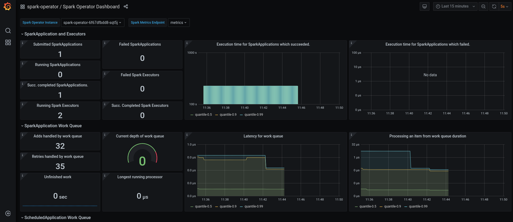

= Spark on OpenShift

This repo provides tools and instructions for deploying and using Google Spark Operator on OpenShift, with custom images including S3 connectors, JMX exporter for monitoring,...

== Custom Spark images

We will first create the custom Spark images (link:https://github.com/bbenzikry/spark-eks[Credits]).

From the spark-images folder:

NOTE: You can modify the Dockerfiles in the repo to change the Spark, Hadoop or other libraries versions.

.Build the base Spark 3 image
[source,bash]
----
docker build --file spark3.Dockerfile --tag spark-odh:s3.0.1-h3.3.0_v0.0.1 .
----

.(Optional) Push the image to your repo
[source,bash]
----
docker tag spark-odh:s3.0.1-h3.3.0_v0.0.1 your_repo/spark-odh:s3.0.1-h3.3.0_v0.0.1
docker push your_repo/spark-odh:s3.0.1-h3.3.0_v0.0.1
----

.Build the PySpark image
[source,bash]
----
docker build --file pyspark.Dockerfile --tag pyspark-odh:s3.0.1-h3.3.0_v0.0.1 --build-arg base_img=spark-odh:s3.0.1-h3.3.0_v0.0.1 .
----

.(Optional) Push the image to your repo
[source,bash]
----
docker tag pyspark-odh:s3.0.1-h3.3.0_v0.0.1 quay.io/guimou/pyspark-odh:s3.0.1-h3.3.0_v0.0.1
docker push quay.io/guimou/pyspark-odh:s3.0.1-h3.3.0_v0.0.1
----

== Spark operator installation

=== Namespace for the operator

The operator will be installed in its own namespace but will be able to monitor all namespaces for jobs to be launched.

.Create the namespace
[source,bash]
----
oc new-project spark-operator
----

NOTE: From now on all the `oc` commands are supposed to be run in the context of this project.

=== Service Account and Role

The operator needs a special Service Account and Role to create pods and services.

From the `spark-operator` folder:

.Create SA with Role
[source,bash]
----
oc apply -f spark-rbac.yaml
----

=== Operator

We will use the standard version of the Google Spark Operator.

.Add the helm repo
[source,bash]
----
helm repo add spark-operator https://googlecloudplatform.github.io/spark-on-k8s-operator
----

.Deploy the helm chart
[source,bash]
----
helm install spark-operator spark-operator/spark-operator --namespace spark-operator  --create-namespace  --set image.tag=v1beta2-1.2.3-3.1.1 --set webhook.enable=true --set resourceQuotaEnforcement.enable=true 
----

=== Monitoring

We will monitor the Spark operator itself, as well as the applications it creates.

NOTE: Prerequisites: Prometheus and Grafana must be installed in your environment. The easiest way is to use the operators. An instance of Grafana must be created so that the ServiceAccount is provisioned.

From spark-operator folder:

.Create the two Services that will expose the metrics
[source,bash]
----
oc apply -f spark-application-metrics_svc.yaml
oc apply -f spark-operator-metrics_svc.yaml
----

.For Prometheus configuration, create the Spark Service Monitor
[source,bash]
----
oc apply -f spark-service-monitor.yaml
----

.For Grafana configuration, create the Prometheus Datasource
[source,bash]
----
oc apply -f prometheus-datasource.yaml
----

NOTE: We will need another datasource to retrieve base CPU and RAM metrics. To do that we'll connect to the "main" OpenShift Prometheus through the following procedure.

.Grant the Grafana Service Account the cluster-monitoring-view cluster role:
[source,bash]
----
oc adm policy add-cluster-role-to-user cluster-monitoring-view -z grafana-serviceaccount
----

.Retrieve the bearer token used to authenticate to Prometheus:
[source,bash]
----
export BEARER_TOKEN=$(oc serviceaccounts get-token grafana-serviceaccount)
----

Deploy `main-prometheus-datasource.yaml` file with the BEARER_TOKEN value.

.Create the "main" Prometheus Datasource
[source,bash]
----
cat main-prometheus-datasource.yaml | sed -e "s/BEARER_TOKEN/$BEARER_TOKEN/g" | oc apply -f -
----

.Create the Grafana dashboards
[source,bash]
----
oc apply -f spark-operator-dashboard.yaml
oc apply -f spark-application-dashboard.yaml
----

== Spark History Server

All the following commands are executed from the `spark-history-server` folder.

=== Object storage

We will use object storage to store the logs data from the Spark jobs. We will first need to create a bucket.

.Create the OBC
[source,bash]
----
oc apply -f spark-hs-obc.yaml
----

IMPORTANT: The Spark/Hadoop instances cannot log direclty into a bucket. A "folder" must exist where the logs will be sent. We will trick Spark/Hadoop into creating this folder by uploading a hidden file to the location we want this folder.

Retrieve the Access and Secret Key from the Secret named `obc-spark-history-server`, the name of the bucket from the ConfigMap named `obc-spark-history-server` as well as the Route to the S3 storage (you may have to create it to access the RGW, default S3 Route in ODF points to MCG).

.Upload any small file, to the bucket (here using the AWS CLI)
[source,bash]
----
export AWS_ACCESS_KEY_ID=YOUR_ACCESS_KEY
export AWS_SECRET_ACCESS_KEY=YOUR_SECRET_ACCESS_KEY
aws --endpoint-url YOUR_ROUTE_TO_S3 s3 cp YOUR_FILE s3://YOUR_BUCKET_NAME/logs-dir/.s3keep
----

Renaming this file `.s3keep` will mark it as hidden from from the History Server and Spark logging mechanism perspective, but the "folder" will appear as being present, making everyone happy!

=== History Server deployment

We can now create the service account, Role, RoleBonding, Service, Route and Deployment for the History Server.

.Fully deploy the History Server
[source,bash]
----
oc apply -f spark-hs-deployment.yaml
----

The UI is not accessible through the Route that was created, named `spark-history-server`

== Usage

We can do a quick test/demo with the standard word count example from Shakespeare's sonnets.

=== Object storage

We'll create a bucket using and ObjectBucketClaim, and populate it with the data.

NOTE: This OBC creates a bucket in the RGW from an OpenShift Data Foundation deployment. Adapt the instructions depending on your S3 provider.

From the `test` folder:

.Create the OBC
[source,bash]
----
oc apply -f obc.yaml
----

Retrieve the Access and Secret Key from the Secret named `spark-demo`, the name of the bucket from the ConfigMap named `spark-demo` as well as the Route to the S3 storage (you may have to create it to access the RGW, default S3 Route in ODF points to MCG).

.Upload the data, the file `shakespeare.txt`, to the bucket (here using the AWS CLI)
[source,bash]
----
export AWS_ACCESS_KEY_ID=YOUR_ACCESS_KEY
export AWS_SECRET_ACCESS_KEY=YOUR_SECRET_ACCESS_KEY
aws --endpoint-url YOUR_ROUTE_TO_S3 s3 cp shakespeare.txt s3://YOUR_BUCKET_NAME/shakespeare.txt
----

TIP: If your endpoint is using a self-signed certificate, you can add `--no-verify-ssl` to the command.

Our application file is `wordcount.py` that you can find in the folder. To make it accessible to the Spark Application, it is packaged as data inside a Config Map. This CM will be mounted as a Volume inside our Spark Application YAML definition.

.Create the application Config Map
[source,bash]
----
oc apply -f wordcount_configmap.yaml
----

=== Basic Tests

We are now ready to launch our Spark Job using the SparkApplication CRD from the operator. Our YAML definition will:

* Use the application file (wordcount.py) from the ConfigMap mounted as a volume
* Inject the Endpoint, Bucket, Access and Secret Keys inside the containers definition so that the driver and the workers can retrieve the data to process it

.Launch the Spark Job
[source,bash]
----
oc apply -f spark_app_shakespeare.yaml
----

If you look at the OpenShift UI you will see the driver, then the workers spawning. They will execute the program, then terminate.

image::test/app_deployment.png[App deployment]

You can now retrieve the results:

.List folder content
[source,bash]
----
aws --endpoint-url YOUR_ROUTE_TO_S3 s3 ls s3://YOUR_BUCKET_NAME/
----

You will see that the results have been saved in a location called `sorted_count_timestamp`.

.Retrieve the results
[source,bash]
----
aws --endpoint-url YOUR_ROUTE_TO_S3 s3 cp s3://YOUR_BUCKET_NAME/sorted_counts_timestamp ./ --recursive
----

There should be different files:

* `_SUCCESS`: just an indicator
* `part-00000` and `part-00001`: the results themselves that will look like:

[source,text]
----
('', 2832)
('and', 490)
('the', 431)
('to', 414)
('my', 390)
('of', 369)
('i', 339)
('in', 323)
('that', 322)
('thy', 287)
('thou', 234)
('with', 181)
('for', 171)
('is', 167)
('not', 166)
('a', 163)
('but', 163)
('love', 162)
('me', 160)
('thee', 157)
....
----

So the sorted list of all the words with their occurences in the full text.

While a job is running you can also have a look at the Grafana dashboards for something like this:

=== History Server Test

We'll now log the output from the job using our history server.

.Launch the Spark Job
[source,bash]
----
oc apply -f spark_app_shakespeare_history_server.yaml
----